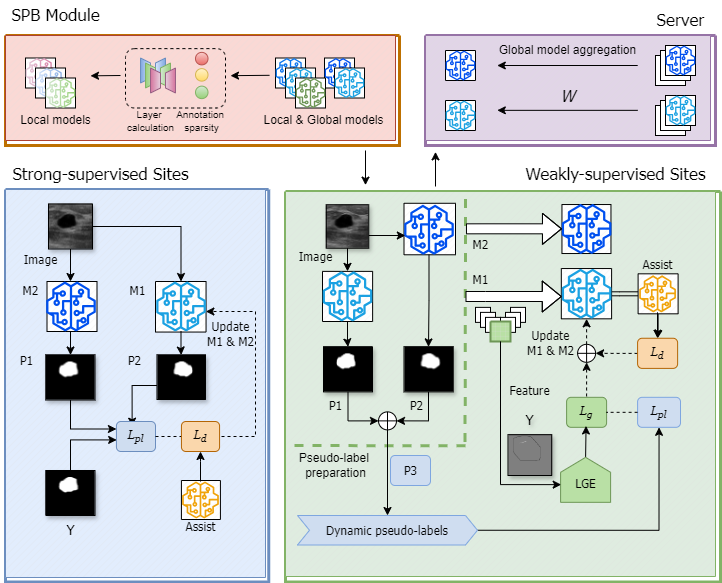

# HSFL for Universal Medical Image Segmentation

This repository is the official implementation of [Federated Hybrid-Supervised Learning for Universal
Medical Image Segmentation](https://github.com). 

>FL faces difficulties with heterogeneous data and limited annotations in medical image segmentation. Motivated by this discovery, this study proposes a hybrid-supervised federated learning method that explores various types of annotations in medical imaging.
>
>To focus on the weak-supervised and unsupervised scenarios in hybrid-supervised, firstly, a federated Gaussian enhancement module was proposed for heterogeneous sparse annotations. The feature extraction module combines the features of multiple weakly-supervised sites and establishes the correlation of similar pixels, thus making up for the deficiency of scarce annotations and the insufficient feature extraction capability of a single machine. Then, a two-stage broadcast mechanism based on supervision sparsity was proposed to alleviate optimization deviation in local models. 



## Requirements

To install requirements:

```setup
conda env create -f fedslag.yaml
```

## Training

To train the federated model, run:

```train
python train.py
```

## Evaluation

To evaluate model on breast task, run:

```eval
python test_breast.py
```

## Contributing

A template README.md for code accompanying a Machine Learning paper:  [README](https://raw.githubusercontent.com/paperswithcode/releasing-research-code/master/templates/README.md)